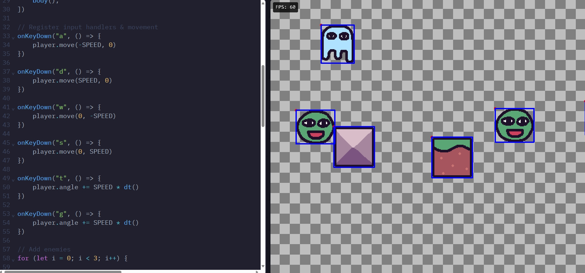

# Entry 1
##### 11/3/24

# Entry 7
##### 6/2/24

## Context
For this year-long project I decided to use the tool Kaboom. Kaboom is a game engine where you can make 2D games. My backup tool was two.js which is another tool for making games. Aftering doing my learning logs I decided to stay with kaboom as my tool. the reason I decided on kaboom is because it feels just right for my skill level and it has been a really fun tool to use. For kaboom I was planning on making a game and working with Johnny. We decided to make a cooking game. This connects to last year where I made a website for cooking. Cooking is something I am passionate about so this year we will make a cooking game. The purposes of my game to the world, is for people get a understanding of how cooking works, if you never cooked before and are too scared to this game would be perfect. So for both LL1 and LL2 I have tinkerin many ways. 

Examples of my tinkering
## LL2

### 10/26/24

After learning things from LL1. I used that and other codes I learned for LL2. So the first thing I learned was giving blocks a mass and being able to move it. 
`````js
body({ mass: 10 }),
`````
This code allowed me to give my sprites a mass and was able to more it.
Another thing I learned was 
`````js
onKeyDown(" ", () => {
	player.angle += SPEED * dt()
	player.move(0, -SPEED)
	player.move(0, SPEED)
})
`````

All three of these are things you can put in the code. One of the rotates the sprites, another cod moves the sprites up or down. The last one moves it left or right.

Now if we go to the playground, I used the collision and changed the code for I changed it so you can use wasd to move, made it so the sprites are different and so the metal and grass block can move when you push it.

The code for this is 

`````js
// Collision handling
kaboom({
	scale: 2,
})

loadSprite("bean", "/sprites/ghosty.png")
loadSprite("ghosty", "/sprites/bean.png")
loadSprite("grass", "/sprites/grass.png")
loadSprite("steel", "/sprites/steel.png")

const SPEED = 320

const player = add([
	sprite("bean"),
	pos(80, 40),
	color(),
	rotate(0),
	area(),
	body(),
])


onKeyDown("a", () => {
	player.move(-SPEED, 0)
})

onKeyDown("d", () => {
	player.move(SPEED, 0)
})

onKeyDown("w", () => {
	player.move(0, -SPEED)
})

onKeyDown("s", () => {
	player.move(0, SPEED)
})

onKeyDown("t", () => {
	player.angle += SPEED * dt()
})

onKeyDown("g", () => {
	player.angle += SPEED * dt()
})

for (let i = 0; i < 3; i++) {

	const x = rand(0, width())
	const y = rand(0, height())

	add([
		sprite("ghosty"),
	        pos(x, y),

		area(),
		"enemy",
	])

}

add([
	sprite("grass"),
	pos(center()),
	area(),
	body({ isStatic: true }),
		body({ mass: 10 }),
	"grass",
])

add([
	sprite("steel"),
	pos(100, 200),
	area(),
	body({ mass: 10 }),
])


player.onCollide("enemy", (enemy) => {
	destroy(enemy)
})


player.onCollideUpdate("enemy", () => {
})


player.onCollideEnd("grass", (a) => {
	debug.log("leave grass")
})


player.onClick(() => {
	debug.log("hello")
})

player.onUpdate(() => {
	// .isHovering() is provided by area() component, which returns a boolean of if the object is currently being hovered on
	if (player.isHovering()) {
		player.color = rgb(0, 0, 255)
	} else {
		player.color = rgb()
	}
})


debug.inspect = true

`````
This is before, where we didn't move anything.


This is after, where we ate everything and move the blocks with wasd using the code we learn and the sprites moving


So this is what I learned and hope to use it for the future when making my freedomproject game.

## Sources

   
## EDP 

## skills


[Next](entry02.md)

[Home](../README.md)
