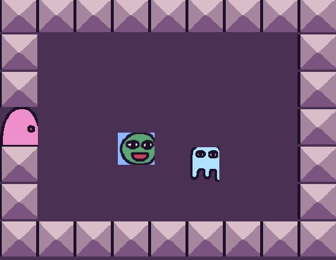

# Entry 3
##### 2/3/25

### content
This year we had the freedom project which is our year long project for sep. I had many ways of learning the tool I used which is kaboom. As I said before one of these websites for learning is the [kaboom website](https://kaboomjs.com/) in this website you can see how different codes are used and you can see the games that they made. This is where I do most of my tinkering and find codes that could help for the future. Another thing I used for learning was youtube videos like [making a game with Kaboom](https://www.youtube.com/watch?v=hgReGsh5xVU) [learning log.md](../tool/learning-log.md). This is the learning log which is where my notes are for these codes I learned. Last time I did my blog was before winter break where I was making a plan on what I should do during the break. So what did I do:


### What I did during winter break
So during the break I was able to make most of the things I wanted.
This is the code:
````` js
kaboom({
	background: [74, 48, 82],
})

loadSprite("bag", "/sprites/../bag.png")
loadSprite("ghosty", "/sprites/../ghost.png")
loadSprite("grass", "/sprites/../grass.png")
loadSprite("steel", "/sprites/../steel.png")
loadSprite("door", "/sprites/../door.png")
loadSprite("key", "/sprites/../key.png")
loadSprite("bean", "/sprites/../bean.png")

scene("main", (levelIdx) => {

	const SPEED = 320

	// character dialog data
	const characters = {
		"a": {
			sprite: "bag",
			msg: "Hi Bean! I would like ...",
		},
		"b": {
			sprite: "ghosty",
			msg: "Who are you? You can see me??",
		},
	}

	// level layouts
	const levels = [
		[
			"---|--------",
			"-     -    -",
			"- $   -    -",
			"-    a-    -",
			"-     -- ---",
			"-   @-     -",
			"-          -",
			"-  - - -   -",
			"-          -",
			"-    -     -",
			"------------",
		],
		[
			"---------",
			"-       -",
			"-   $   -",
			"|       -",
			"-    b  -",
			"-  @    -",
			"---------",
		],
	]

	const level = addLevel(levels[levelIdx], {
		tileWidth: 64,
		tileHeight: 64,
		pos: vec2(64, 64),
		tiles: {
			"=": () => [
				sprite("grass"),
				area(),
				body({ isStatic: true }),
				anchor("center"),
			],
			"-": () => [
				sprite("steel"),
				area(),
				body({ isStatic: true }),
				anchor("center"),
			],
			"$": () => [
				sprite("key"),
				area(),
				anchor("center"),
				"key",
			],
			"@": () => [
				sprite("bean"),
				area(),
				body(),
				anchor("center"),
				"player",
			],
			"|": () => [
				sprite("door"),
				area(),
				body({ isStatic: true }),
				anchor("center"),
				"door",
			],
		},
		// any() is a special function that gets called everytime there's a
		// symbole not defined above and is supposed to return what that symbol
		// means
		wildcardTile(ch) {
			const char = characters[ch]
			if (char) {
				return [
					sprite(char.sprite),
					area(),
					body({ isStatic: true }),
					anchor("center"),
					"character",
					{ msg: char.msg },
				]
			}
		},
	})

	// get the player game obj by tag
	const player = level.get("player")[0]

	function addDialog() {
		const h = 160
		const pad = 16
		const bg = add([
			pos(0, height() - h),
			rect(width(), h),
			color(0, 0, 0),
			z(100),
		])
		const txt = add([
			text("", {
				width: width(),
			}),
			pos(0 + pad, height() - h + pad),
			z(100),
		])
		bg.hidden = true
		txt.hidden = true
		return {
			say(t) {
				txt.text = t
				bg.hidden = false
				txt.hidden = false
			},
			dismiss() {
				if (!this.active()) {
					return
				}
				txt.text = ""
				bg.hidden = true
				txt.hidden = true
			},
			active() {
				return !bg.hidden
			},
			destroy() {
				bg.destroy()
				txt.destroy()
			},
		}
	}

	let hasKey = false
	const dialog = addDialog()

	player.onCollide("key", (key) => {
		destroy(key)
		hasKey = true
	})

	player.onCollide("door", () => {
		if (hasKey) {
			if (levelIdx + 1 < levels.length) {
				go("main", levelIdx + 1)
			} else {
				go("main", levelIdx - 1)
			}
		} else {
			dialog.say("you got no key!")
		}
	})

	// talk on touch
	player.onCollide("character", (ch) => {
		dialog.say(ch.msg)
	})

	const dirs = {
		"left": LEFT,
		"right": RIGHT,
		"up": UP,
		"down": DOWN,
	}

	for (const dir in dirs) {
		onKeyPress(dir, () => {
			dialog.dismiss()
		})
		onKeyDown(dir, () => {
			player.move(dirs[dir].scale(SPEED))
		})
	}

})

scene("win", () => {
	add([
		text("You Win!"),
		pos(width() / 2, height() / 2),
		anchor("center"),
	])
})

go("main", 0)

`````
What this code does is that you can talk to people and go between two levels. 



You can hop between the levels.

So during the the break we made levels and had it so you can go between the levels. We need to add texture and make more levels. 

### My plans from here are
 
So as I said the plan for the future is to make it so we can have some texture, make more levels, have it so we can talk to npc and when a npc finish ordering they sit down and after they leave when they eat. When we finish these steps we want to do more where you can go around the map and explore. You can maybe get a different line of work. These are the plans for the future and I really hope that the game will be enjoyable for most.

## EDP 
EDP or Engineering Design Process is the part of the project you are on. There are 8 different parts. As I said before, the problem I am trying to solve is people being too scared to cook. I plan on making a game that everyone can enjoy and not be scared of cooking. So wondering how we are going to make this game, while I already brainstormed the game, we want to have a game with different levels that you could go between, each level there are different things to do. This was the brainstorming part. After this we get to the planning part which is the part we finished during the break, we had an outline of the plan and we made a prototype. So the part we are on at the moment is the create part which is making a prototype and seeing if it works. The prototype we made works but we just need to add more. This is part of the Engineering Design Process we are on.

## Skill

1. One skill I've accuired is decision making and this was kind of troublesome in a way because there were times when i had to decide what ideas to cook up for the practice code I was doing on Kaboom. Also i had to decide what kind of practice code i'd make so it could be easier while using the keyboard movements, but also kind of challenging and trying new obstacles and blocks for bean to move through.

2.Another skill I had to work on was really reading the material i was working on in depth. This was a problem at first because i did not want to read every word when it came to instructions. usually i would skim through everything and think it would be fine since i've been using most of the same code. But not reading instructions and tutorials was doing more harm than good because i'd be lost when it came time to do the exercise.

3.Another skill I learned was to not be afraid to ask my classmates because I am more self reliant and choose to do things by myself. I realized how important this skill is due to me improving from my peers' comments and feedback on my work. It is important to build relationships to kind of help give you a push when you need it. I usually try things on my own first, but if im stuck i'll ask my friends who are working on teh same topics to review my work and give helpfull feedback.

[Previous](entry02.md) | [Next](entry04.md)

[Home](../README.md)
