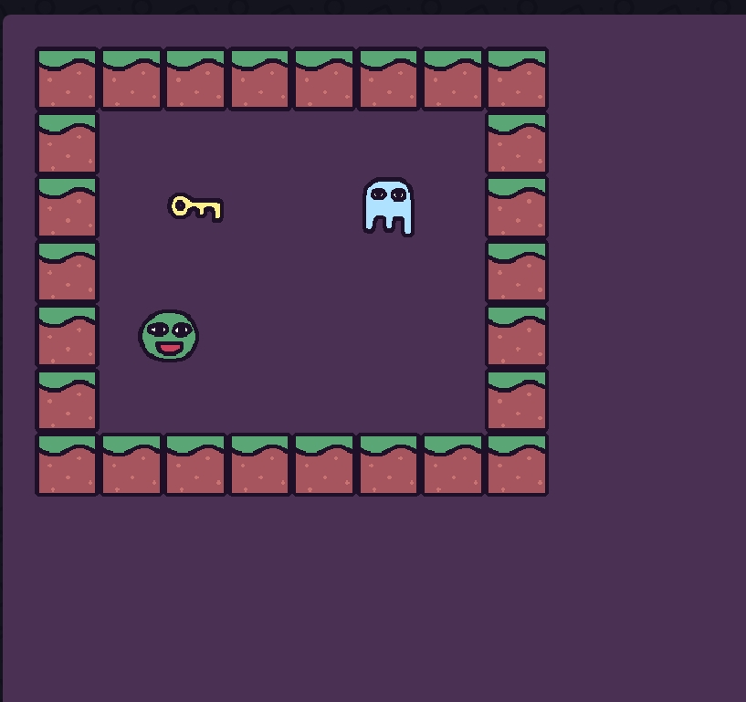
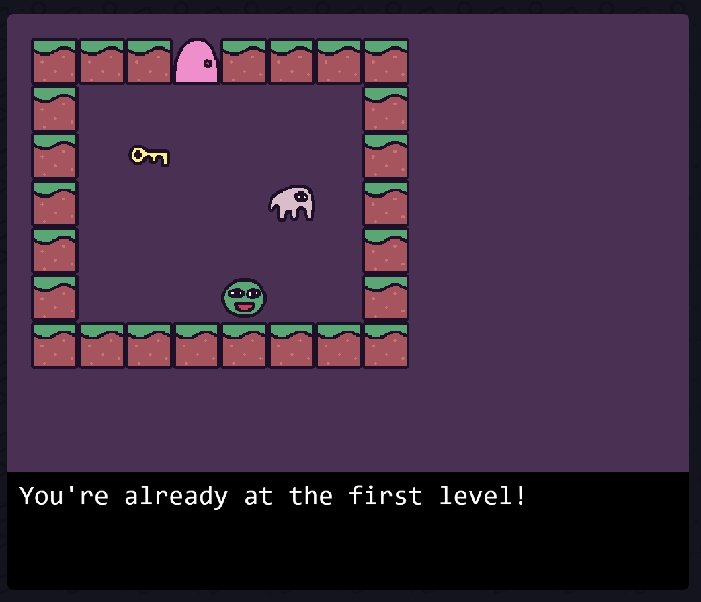

# Entry 4
# Entry 3
##### 2/3/25

### content
This year we had the freedom project, our year-long project for Sep. I have been learning the tool I used which is kaboom in many ways. As I said before one of these websites for learning is the [kaboom website](https://kaboomjs.com/) in this website you can see how different codes are used and you can see the games that they made. This is where I do most of my tinkering and find codes that could help in the future. Another thing I used for learning was YouTube videos like [making a game with Kaboom](https://www.youtube.com/watch?v=hgReGsh5xVU) [learning log.md](../tool/learning-log.md). This is the learning log which is where my notes are for the codes I learned. The last time I did my blog was after winter break when I planned what to do during the break and also did LL. So what did I do: 


### What I did during the break and for my LL

I made a code where there are different levels and when you press r you return to the old level. 
`````js
kaboom({
	background: [74, 48, 82],
});

// Load sprites
loadSprite("bag", "/sprites/bag.png");
loadSprite("ghosty", "/sprites/ghosty.png");
loadSprite("grass", "/sprites/grass.png");
loadSprite("steel", "/sprites/steel.png");
loadSprite("door", "/sprites/door.png");
loadSprite("key", "/sprites/key.png");
loadSprite("bean", "/sprites/bean.png");

// Define characters and their dialog
const characters = {
	"a": {
		sprite: "bag",
		msg: "Hi Bean! You should get that key!",
	},
	"b": {
		sprite: "ghosty",
		msg: "Who are you? You can see me??",
	},
	"c": {
		sprite: "ghosty",
		msg: "Boo! I'm a friendly ghost.",
	},
	"d": {
		sprite: "bag",
		msg: "Watch out for traps!",
	},
};

// Define levels
const levels = [
	// Level 1
	[
		"===|====",
		"=      =",
		"= $    =",
		"=    a =",
		"=      =",
		"=   @  =",
		"========",
	],
	// Level 2
	[
		"--------",
		"-      -",
		"-   $  -",
		"|      -",
		"-    b -",
		"-  @   -",
		"--------",
	],
	// Level 3
	[
		"========",
		"=      =",
		"= $  c =",
		"=      =",
		"=  @   =",
		"=      =",
		"========",
	],
	// Level 4
	[
		"--------",
		"-      -",
		"- $  d -",
		"|      -",
		"-  @   -",
		"-      -",
		"--------",
	],
	// Level 5
	[
		"========",
		"=      =",
		"= $    =",
		"=      =",
		"=  @   =",
		"=      =",
		"========",
	],
];

// Main game scene
scene("main", (levelIdx) => {
	const SPEED = 320;

	// Create the level
	const level = addLevel(levels[levelIdx], {
		tileWidth: 64,
		tileHeight: 64,
		pos: vec2(64, 64),
		tiles: {
			"=": () => [
				sprite("grass"),
				area(),
				body({ isStatic: true }),
				anchor("center"),
			],
			"-": () => [
				sprite("steel"),
				area(),
				body({ isStatic: true }),
				anchor("center"),
			],
			"$": () => [
				sprite("key"),
				area(),
				anchor("center"),
				"key",
			],
			"@": () => [
				sprite("bean"),
				area(),
				body(),
				anchor("center"),
				"player",
			],
			"|": () => [
				sprite("door"),
				area(),
				body({ isStatic: true }),
				anchor("center"),
				"door",
			],
		},
		wildcardTile(ch) {
			const char = characters[ch];
			if (char) {
				return [
					sprite(char.sprite),
					area(),
					body({ isStatic: true }),
					anchor("center"),
					"character",
					{ msg: char.msg },
				];
			}
		},
	});

	// Get the player object
	const player = level.get("player")[0];

	// Dialog system
	function addDialog() {
		const h = 160;
		const pad = 16;
		const bg = add([
			pos(0, height() - h),
			rect(width(), h),
			color(0, 0, 0),
			z(100),
		]);
		const txt = add([
			text("", { width: width() }),
			pos(pad, height() - h + pad),
			z(100),
		]);
		bg.hidden = true;
		txt.hidden = true;
		return {
			say(t) {
				txt.text = t;
				bg.hidden = false;
				txt.hidden = false;
			},
			dismiss() {
				if (!this.active()) return;
				txt.text = "";
				bg.hidden = true;
				txt.hidden = true;
			},
			active() {
				return !bg.hidden;
			},
			destroy() {
				bg.destroy();
				txt.destroy();
			},
		};
	}

	let hasKey = false;
	const dialog = addDialog();

	// Key collection
	player.onCollide("key", (key) => {
		destroy(key);
		hasKey = true;
		dialog.say("You found a key!");
	});

	// Door interaction
	player.onCollide("door", () => {
		if (hasKey) {
			if (levelIdx + 1 < levels.length) {
				go("main", levelIdx + 1); // Go to the next level
			} else {
				go("win"); // Win the game
			}
		} else {
			dialog.say("You need a key to open the door!");
		}
	});

	// Go back to the previous level when "R" is pressed
	onKeyPress("r", () => {
		if (levelIdx > 0) {
			go("main", levelIdx - 1); // Go to the previous level
		} else {
			dialog.say("You're already at the first level!");
		}
	});

	// Character interaction
	player.onCollide("character", (ch) => {
		dialog.say(ch.msg);
	});

	// Player movement
	const dirs = {
		"left": LEFT,
		"right": RIGHT,
		"up": UP,
		"down": DOWN,
	};
	for (const dir in dirs) {
		onKeyPress(dir, () => dialog.dismiss());
		onKeyDown(dir, () => player.move(dirs[dir].scale(SPEED)));
	}
});

// Win scene
scene("win", () => {
	add([
		text("You Win!", { size: 48 }),
		pos(width() / 2, height() / 2),
		anchor("center"),
	]);
});

// Start the game
go("main", 0);
`````



This is what I did for the code as you can see, you can go back, talk to NPC, go to a new level, and reach the end. This is what I did and I have plans to change the background and texture. 
### Progess 


## EDP 


## Skill


[Previous](entry03.md) | [Next](entry05.md)

[Home](../README.md)
