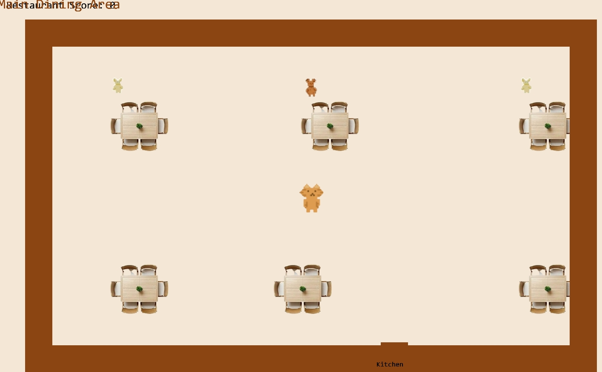
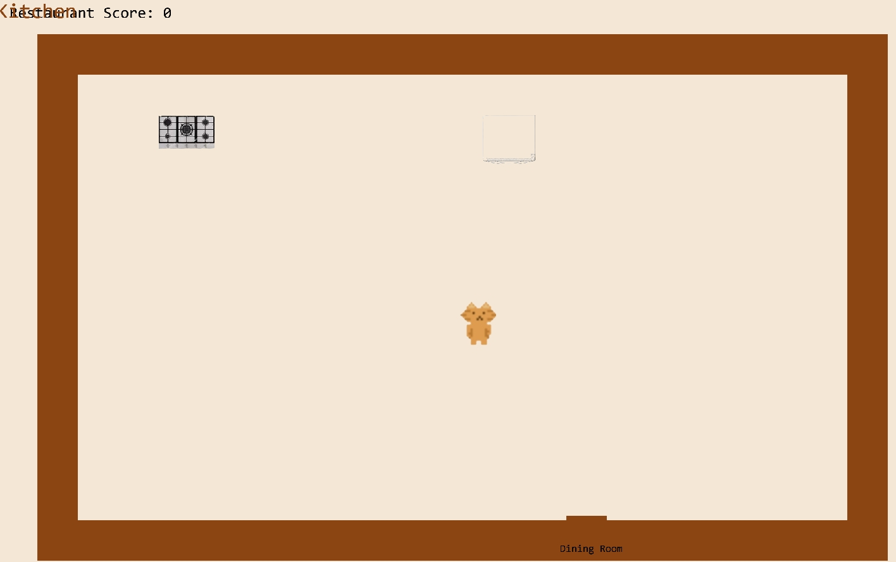
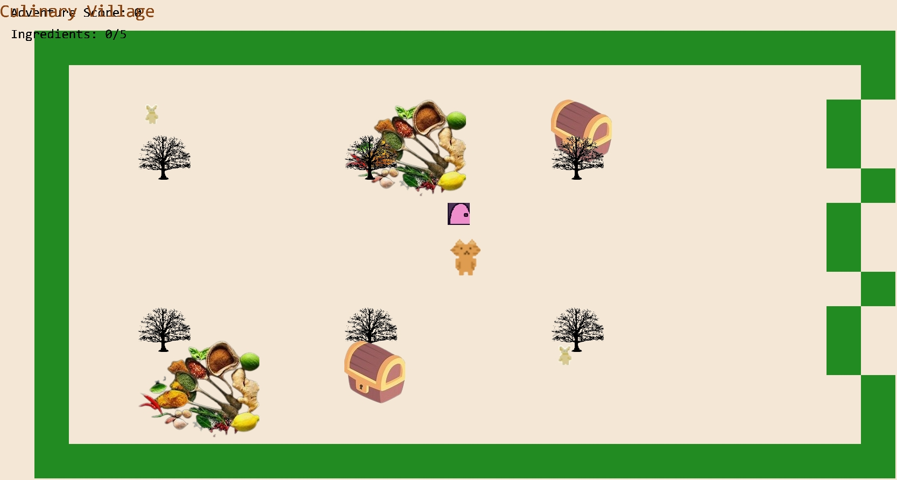
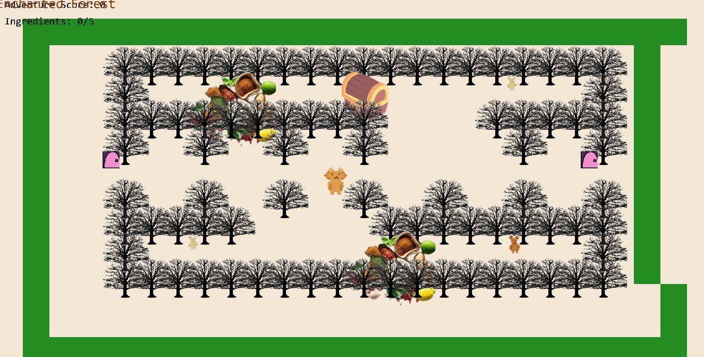

# Entry 5
##### 3/16/25

### content
This year we had the Freedom Project, our year-long project for Sep. I have been learning the tool I used, which is Kaboom, in many ways. As I said before, one of these websites for learning is the [kaboom website](https://kaboomjs.com/). On this website, you can see how different codes are used, and you can see the games that they made. This is where I do most of my tinkering and find code that could help in the future. Another thing I used for learning was YouTube videos like [making a game with Kaboom](https://www.youtube.com/watch?v=hgReGsh5xVU) [learning log.md](../tool/learning-log.md). This is the learning log, which is where my notes are for the code I learned. We have reached the end of this project, which in my blog 5, I will talk about the progress we have made, what we have achieved, and many more. The code and pictures are down:
### work
````` js
<!DOCTYPE html>
<html>
    <head>
        <meta charset="utf-8">
        <meta name="viewport" content="width=device-width, initial-scale=1">
        <link href="https://cdn.jsdelivr.net/npm/bootstrap@5.2.1/dist/css/bootstrap.min.css" rel="stylesheet" />
        <title>Restaurant Adventure</title>
        <style>
            body {
                background-color: #333;
                overflow: hidden;
                margin: 0;
                padding: 0;
            }
            #menu-container {
                position: fixed;
                top: 0;
                left: 0;
                width: 100%;
                height: 100%;
                display: flex;
                flex-direction: column;
                justify-content: center;
                align-items: center;
                z-index: 1000;
                background-color: rgba(0, 0, 0, 0.7);
            }
            .menu {
                background-color: #f5e7d5;
                padding: 2rem;
                border-radius: 15px;
                text-align: center;
                box-shadow: 0 0 20px rgba(0, 0, 0, 0.5);
                max-width: 600px;
            }
            .game-title {
                font-size: 3.5rem;
                color: #8b4513;
                margin-bottom: 1.5rem;
                font-weight: bold;
                text-shadow: 2px 2px 4px rgba(0, 0, 0, 0.3);
            }
            .role-selection {
                display: flex;
                justify-content: center;
                gap: 20px;
                margin-bottom: 1.5rem;
            }
            .btn-role {
                background-color: #8b4513;
                color: white;
                font-size: 1.2rem;
                padding: 0.8rem 1.5rem;
                border: none;
                border-radius: 10px;
                cursor: pointer;
                transition: all 0.3s;
                width: 180px;
            }
            .btn-role:hover {
                background-color: #a0522d;
                transform: scale(1.05);
            }
            .instructions {
                color: #333;
                font-size: 1.1rem;
                margin-top: 1rem;
                text-align: left;
            }
            .role-description {
                margin: 1rem 0;
                padding: 1rem;
                background-color: rgba(139, 69, 19, 0.1);
                border-radius: 8px;
            }
        </style>
    </head>
    <body>
        <!-- Main Menu -->
        <div id="menu-container">
            <div class="menu">
                <div class="game-title">Restaurant Adventure</div>
                <div class="role-selection">
                    <button id="chef-btn" class="btn-role">Be a Chef</button>
                    <button id="adventurer-btn" class="btn-role">Be an Adventurer</button>
                </div>
                <div id="chef-desc" class="role-description">
                    <h5>Chef Gameplay:</h5>
                    <ul>
                        <li>Manage the restaurant kitchen</li>
                        <li>Cook meals for customers</li>
                        <li>Keep customers happy to earn points</li>
                        <li>Upgrade your kitchen equipment</li>
                    </ul>
                </div>
                <div id="adventurer-desc" class="role-description" style="display:none;">
                    <h5>Adventurer Gameplay:</h5>
                    <ul>
                        <li>Explore a culinary fantasy world</li>
                        <li>Discover legendary recipes</li>
                        <li>Battle food monsters</li>
                        <li>Complete epic cooking quests</li>
                    </ul>
                </div>
                <div class="instructions">
                    <h4>How to Play:</h4>
                    <ul>
                        <li>Use arrow keys to move your character</li>
                        <li>Press 'E' to interact with objects and people</li>
                        <li>Switch between areas using doors/portals</li>
                    </ul>
                </div>
            </div>
        </div>

        <script src="https://cdn.jsdelivr.net/npm/bootstrap@5.2.1/dist/js/bootstrap.bundle.min.js"></script>
        <script src="https://unpkg.com/kaboom@3000.0.1/dist/kaboom.js"></script>
        <script>
            // Initialize Kaboom with larger canvas
            const k = kaboom({
                background: [245, 231, 213],
                width: 2000,
                height: 1000,
                global: false
            });

            // Make Kaboom functions available globally
            const {
                loadSprite,
                scene,
                addLevel,
                rect,
                color,
                area,
                body,
                sprite,
                scale,
                text,
                pos,
                vec2,
                z,
                fixed,
                anchor,
                LEFT,
                RIGHT,
                UP,
                DOWN,
                onKeyPress,
                onKeyDown,
                go,
                height,
                width,
                add,
                destroy,
                loop,
                get,
                onSceneLeave
            } = k;

            // Role selection
            document.getElementById("chef-btn").addEventListener("click", function() {
                document.getElementById("chef-desc").style.display = "block";
                document.getElementById("adventurer-desc").style.display = "none";
            });

            document.getElementById("adventurer-btn").addEventListener("click", function() {
                document.getElementById("adventurer-desc").style.display = "block";
                document.getElementById("chef-desc").style.display = "none";
            });

            // Start game with selected role
            document.getElementById("chef-btn").addEventListener("click", function() {
                setTimeout(() => {
                    const menuContainer = document.getElementById("menu-container");
                    menuContainer.parentNode.removeChild(menuContainer);
                    startGame("chef");
                }, 300);
            });

            document.getElementById("adventurer-btn").addEventListener("click", function() {
                setTimeout(() => {
                    const menuContainer = document.getElementById("menu-container");
                    menuContainer.parentNode.removeChild(menuContainer);
                    startGame("adventurer");
                }, 300);
            });

            function startGame(role) {
                // Load sprites
                loadSprite("chef", "sprites/../c.png");
                loadSprite("adventurer", "sprites/../c.png");
                loadSprite("customer1", "sprites/../c1.png");
                loadSprite("customer2", "sprites/../c3.png");
                loadSprite("table", "sprites/../table.png");
                loadSprite("door", "sprites/../door.png");
                loadSprite("stove", "sprites/../stove.png");
                loadSprite("counter", "sprites/../c4.png");
                loadSprite("fridge", "sprites/../fridge.png");

                // Adventurer-specific sprites
                loadSprite("quest-giver", "sprites/../c1.png");
                loadSprite("treasure", "sprites/../treasure.png");
                loadSprite("ingredient", "sprites/../ingredient.png");
                loadSprite("portal", "sprites/../door.png");
                loadSprite("monster", "sprites/../c3.png");
                loadSprite("forest-tree", "sprites/../tree.png");
                loadSprite("mountain", "sprites/../mountain.png");
                loadSprite("castle", "sprites/../castle.png");

                // Define characters and their dialog based on role
                const chefCharacters = {
                    "c": { sprite: "customer1", msg: "I'd like a burger, please!" },
                    "d": { sprite: "customer2", msg: "Can I get a pizza?" },
                    "e": { sprite: "customer1", msg: "Just a salad for me, thanks!" }
                };

                const adventurerCharacters = {
                    "q": { sprite: "quest-giver", msg: "Find the 5 legendary ingredients!" },
                    "t": { sprite: "treasure", msg: "You found a treasure chest! +50 points" },
                    "i": { sprite: "ingredient", msg: "Rare ingredient found! +20 points" },
                    "m": { sprite: "monster", msg: "A wild Food Monster appears!" }
                };

                // Define levels for each role
                const chefLevels = [
                    // Dining Area
                    [
                        "---------------------",
                        "-                   -",
                        "-  c      d       e -",
                        "-  T      T       T -",
                        "-                   -",
                        "-                   -",
                        "-         @         -",
                        "-                   -",
                        "-                   -",
                        "-  T     T        T -",
                        "-                   -",
                        "-                   -",
                        "---------------------",
                    ],
                    // Kitchen Area
                    [
                        "---------------------",
                        "-                   -",
                        "-  S   C   F        -",
                        "-                   -",
                        "-                   -",
                        "-                   -",
                        "-         @         -",
                        "-                   -",
                        "-                   -",
                        "-                   -",
                        "-                   -",
                        "-                   -",
                        "---------------------",
                    ]
                ];

                // Expanded Adventurer World with 4 unique areas
                const adventurerLevels = [
                    // 0 - Culinary Village
                    [
                        "-------------------------",
                        "-                       -",
                        "-  q     i     t       -",
                        "-  T     T     T       -",
                        "-                       -",
                        "-           P          -",
                        "-           @          -",
                        "-                       -",
                        "-  T     T     T       -",
                        "-  i     t     q       -",
                        "-                       -",
                        "-                       -",
                        "-------------------------",
                    ],
                    // 1 - Enchanted Forest
                    [
                        "-------------------------",
                        "-  ^^^^^^^^^^^^^^^^^^^ -",
                        "-  ^  i     t     q  ^ -",
                        "-  ^^^^^^^^^^    ^^^^^ -",
                        "-  ^  ^  ^  ^     ^  ^ -",
                        "-  P        @        P -",
                        "-  ^  ^  ^  ^  ^  ^  ^ -",
                        "-  ^^^^^     ^^^^^^^^^ -",
                        "-  ^  q     i     m  ^ -",
                        "-  ^^^^^^^^^^^^^^^^^^^ -",
                        "-                       -",
                        "-                       -",
                        "-------------------------",
                    ],
                    // 2 - Spice Mountains
                    [
                        "-------------------------",
                        "-  MMMMMMMMMMMMMMMMMMM -",
                        "-  M  t  M  i  M  q  M -",
                        "-  MM                M -",
                        "-  M                 M -",
                        "-  P           @     P -",
                        "-  M              M  M -",
                        "-  MMM              MM -",
                        "-  M  m  M  i  M  t  M -",
                        "-  MMMMMMMMMMMMMMMMMMM -",
                        "-                       -",
                        "-                       -",
                        "-------------------------",
                    ],
                    // 3 - Royal Kitchen Castle
                    [
                        "-------------------------",
                        "-  CCCCCCCCCCCCCCCCCCC -",
                        "-  C  q  C  t  C  i  C -",
                        "-  CCCCCCCCCCCCCCCCCCC -",
                        "-  C  C  C  C  C  C  C -",
                        "-  P  C  C  @  C  C  P -",
                        "-  C  C  C  C  C  C  C -",
                        "-  CCCCCCCCCCCCCCCCCCC -",
                        "-  C  i  C  t  C  m  C -",
                        "-  CCCCCCCCCCCCCCCCCCC -",
                        "-                       -",
                        "-                       -",
                        "-------------------------",
                    ]
                ];

                // Game variables
                let score = 0;
                let currentLevel = 0;
                let playerRole = role;
                let ingredientsCollected = 0;
                const totalIngredientsNeeded = 5;

                // Main game scene
                scene("main", (levelIdx) => {
                    const SPEED = 240;
                    const levels = playerRole === "chef" ? chefLevels : adventurerLevels;
                    const characters = playerRole === "chef" ? chefCharacters : adventurerCharacters;

                    // Create the level
                    const level = addLevel(levels[levelIdx], {
                        tileWidth: 64,
                        tileHeight: 64,
                        pos: vec2(64, 64),
                        tiles: {
                            "-": () => [
                                rect(64, 64),
                                color(playerRole === "chef" ? [139, 69, 19] : [34, 139, 34]), // Different floor colors
                                area(),
                                body({ isStatic: true }),
                            ],
                            "T": () => [
                                sprite(playerRole === "chef" ? "table" : "forest-tree"),
                                area(),
                                body({ isStatic: true }),
                                "furniture",
                                scale(0.7)
                            ],
                            "@": () => [
                                sprite(playerRole === "chef" ? "chef" : "adventurer"),
                                area(),
                                body(),
                                "player",
                                scale(0.5)
                            ],
                            // Chef-specific objects
                            "S": playerRole === "chef" ? () => [
                                sprite("stove"),
                                area(),
                                body({ isStatic: true }),
                                "kitchen-equipment",
                                scale(0.6),
                                "stove"
                            ] : undefined,
                            "C": playerRole === "chef" ? () => [
                                sprite("counter"),
                                area(),
                                body({ isStatic: true }),
                                "kitchen-equipment",
                                scale(0.6),
                                "counter"
                            ] : undefined,
                            "F": playerRole === "chef" ? () => [
                                sprite("fridge"),
                                area(),
                                body({ isStatic: true }),
                                "kitchen-equipment",
                                scale(0.6),
                                "fridge"
                            ] : undefined,
                            // Adventurer-specific objects
                            "P": playerRole === "adventurer" ? () => [
                                sprite("portal"),
                                area(),
                                body({ isStatic: true }),
                                "portal",
                                scale(0.6),
                                { targetLevel: (levelIdx + 1) % adventurerLevels.length }
                            ] : undefined,
                            "^": playerRole === "adventurer" ? () => [
                                sprite("forest-tree"),
                                area(),
                                body({ isStatic: true }),
                                "obstacle",
                                scale(0.8)
                            ] : undefined,
                            "M": playerRole === "adventurer" ? () => [
                                sprite("mountain"),
                                area(),
                                body({ isStatic: true }),
                                "obstacle",
                                scale(0.8)
                            ] : undefined,
                            "C": playerRole === "adventurer" ? () => [
                                sprite("castle"),
                                area(),
                                body({ isStatic: true }),
                                "obstacle",
                                scale(0.8)
                            ] : undefined
                        },
                        wildcardTile(ch) {
                            const char = characters[ch];
                            if (char) {
                                return [
                                    sprite(char.sprite),
                                    area(),
                                    body({ isStatic: true }),
                                    "character",
                                    {
                                        msg: char.msg,
                                        type: ch
                                    },
                                ];
                            }
                        },
                    });

                    // Get the player object
                    const player = level.get("player")[0];

                    // Dialog system
                    function addDialog() {
                        const h = 120;
                        const pad = 16;
                        const bg = add([
                            pos(0, height() - h),
                            rect(width(), h),
                            color(0, 0, 0, 200),
                            z(100),
                        ]);
                        const txt = add([
                            text("", {
                                width: width() - pad * 2,
                                size: 18
                            }),
                            pos(pad, height() - h + pad),
                            z(100),
                            color(255, 255, 255),
                        ]);
                        bg.hidden = true;
                        txt.hidden = true;
                        return {
                            say(t) {
                                txt.text = t;
                                bg.hidden = false;
                                txt.hidden = false;
                            },
                            dismiss() {
                                if (!this.active()) return;
                                txt.text = "";
                                bg.hidden = true;
                                txt.hidden = true;
                            },
                            active() {
                                return !bg.hidden;
                            },
                        };
                    }

                    const dialog = addDialog();

                    // Score display
                    const scoreDisplay = add([
                        text(`${playerRole === "chef" ? "Restaurant" : "Adventure"} Score: ${score}`, { size: 24 }),
                        pos(20, 20),
                        color(0, 0, 0),
                        z(50),
                        fixed()
                    ]);

                    // Adventurer-specific displays
                    if (playerRole === "adventurer") {
                        const ingredientDisplay = add([
                            text(`Ingredients: ${ingredientsCollected}/${totalIngredientsNeeded}`, { size: 24 }),
                            pos(20, 60),
                            color(0, 0, 0),
                            z(50),
                            fixed()
                        ]);
                    }

                    // Interact with characters and objects
                    player.onCollide("character", (character) => {
                        dialog.say(character.msg);

                        // Adventurer-specific interactions
                        if (playerRole === "adventurer") {
                            if (character.type === "t") { // Treasure
                                score += 50;
                                scoreDisplay.text = `Adventure Score: ${score}`;
                                destroy(character);
                            } else if (character.type === "i") { // Ingredient
                                score += 20;
                                ingredientsCollected++;
                                scoreDisplay.text = `Adventure Score: ${score}`;
                                destroy(character);

                                // Check if all ingredients collected
                                if (ingredientsCollected >= totalIngredientsNeeded) {
                                    dialog.say("Congratulations! You found all legendary ingredients!");
                                }
                            } else if (character.type === "m") { // Monster
                                // Simple battle system
                                const battleOutcome = Math.random() > 0.3; // 70% chance to win
                                if (battleOutcome) {
                                    score += 30;
                                    scoreDisplay.text = `Adventure Score: ${score}`;
                                    dialog.say("You defeated the Food Monster! +30 points");
                                    destroy(character);
                                } else {
                                    dialog.say("The Food Monster got away... Try again!");
                                }
                            }
                        }
                    });

                    if (playerRole === "chef") {
                        player.onCollide("kitchen-equipment", (equipment) => {
                            if (equipment.sprite === "stove") {
                                dialog.say("Time to cook some food!");
                            } else if (equipment.sprite === "counter") {
                                dialog.say("Place prepared dishes here for serving");
                            } else if (equipment.sprite === "fridge") {
                                dialog.say("Get fresh ingredients from here");
                            }
                        });
                    }

                    // Portals for adventurer to switch between areas
                    if (playerRole === "adventurer") {
                        player.onCollide("portal", (portal) => {
                            go("main", portal.targetLevel);
                        });
                    } else {
                        // Door for chef to switch between kitchen and dining
                        const door = add([
                            rect(64, 32),
                            pos(1000 - 100, height() / 2 + 325),
                            area(),
                            color(139, 69, 19),
                            "door",
                            {
                                targetLevel: levelIdx === 0 ? 1 : 0,
                                areaName: levelIdx === 0 ? "Kitchen" : "Dining Room"
                            }
                        ]);

                        // Door label
                        add([
                            text(levelIdx === 0 ? "Kitchen" : "Dining Room", { size: 16 }),
                            pos(1000 - 110, height() / 2 + 370),
                            color(0, 0, 0)
                        ]);

                        player.onCollide("door", (d) => {
                            go("main", d.targetLevel);
                        });
                    }

                    // Player movement
                    const dirs = {
                        "left": LEFT,
                        "right": RIGHT,
                        "up": UP,
                        "down": DOWN,
                    };
                    for (const dir in dirs) {
                        onKeyPress(dir, () => dialog.dismiss());
                        onKeyDown(dir, () => player.move(dirs[dir].scale(SPEED)));
                    }

                    // Display area name
                    const chefAreaNames = ["Main Dining Area", "Kitchen"];
                    const adventurerAreaNames = [
                        "Culinary Village",
                        "Enchanted Forest",
                        "Spice Mountains",
                        "Royal Kitchen Castle"
                    ];

                    add([
                        text(playerRole === "chef" ?
                            chefAreaNames[levelIdx] :
                            adventurerAreaNames[levelIdx], {
                            size: 32,
                            width: width(),
                        }),
                        pos(width() / 2, 30),
                        anchor("center"),
                        color(139, 69, 19),
                        z(50),
                        fixed()
                    ]);
                });

                // Start the game
                go("main", 0);
            }
        </script>
    </body>
</html>
`````
This is the code for my project, which is like a cooking game and an adventure game. It is like the anime where they die and pick a class. This is what I base my project off of. Pictures of this would be 




These are different levels of the game. 

## EDP 
As you can see, we have done the prototype and were able to make everything work for our game. We just need to make improvements to the game, which is the part I am on. The game works, but it isn't the best, so we need to change some stuff and make it work better for the people. Also, for improving the game, we wanted to add more, maybe the people can cook, and there is a  monster to fight. For every game, there is always improvement, just like ours, and I need to make those changes to the game. So this is the part of the Engineering Design process I am on, and this time, and will be adding improvements to it. 
 

## Skills
1. First skill I needed to work on was researching what my project was going to contain and be something original but also based off things that people would like to play on a daily basis. I looked around and found star dew valley and thought it was pretty similar to my project since its about finding resources and has different objectives. I looked on youtube about the basic codes and such and found pydew valley which goes over python which i thought was cool and found some p5js as well to create a base or starting point for my project. It was difficult for me to research especially if i keep seeing the same things over and over again, but knowing that it will contribute to my project made me search deeper to try and find help with parts of my project i was stuck on.
2. My second skill was time management especially with the MVP that we had to do and also progressing with the project. Also with other classes clashing in between, i had to have set times for what classes homework I had to do and which was on my priority list. Having to juggle everything with a steady pace was quite challenging, but having a clear mind and calm attitude about things made it easier for me to focus on one thing and put my best work into it. Ofcourse having working with someone else on my project meant I had to do my parts in order to keep up with the dates, so it doesn't affect my partner.
3. My third skill was communicating with my partner since we work in the project together, we needed to communicate especially on how we needed to do things to complete the goals we had for this project. It was a bit difficult when we did our own things since we and different ideas on what to incorporate into our project. The fastest way to fix a problem or misunderstanding is to communicate what we wanted to do and then to find a middle ground on what we each should do. This helped me become more of a problem solver with my partner and we then each did what we wanted to do without missing any other assignments or having personal problems. We also learned some issues of code from each other and overall the different levels of the stages and objects around is going well together.


[Previous](entry04.md) | [Next](entry06.md)

[Home](../README.md)
