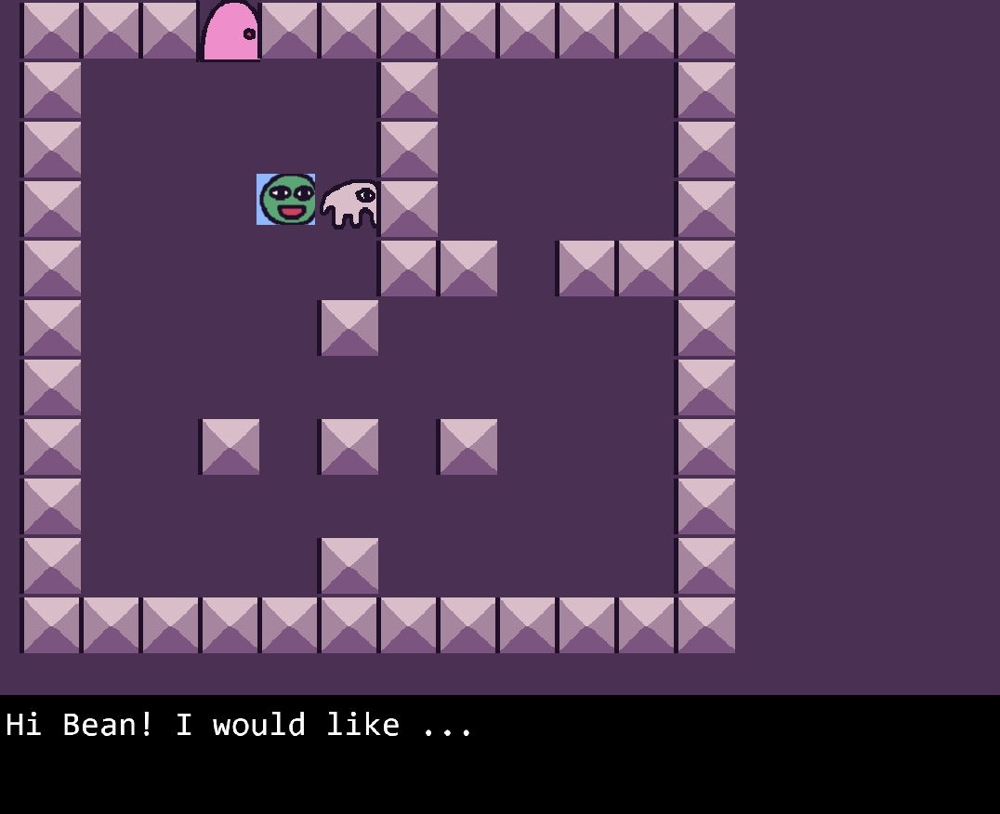
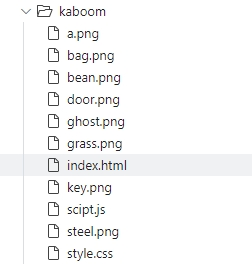
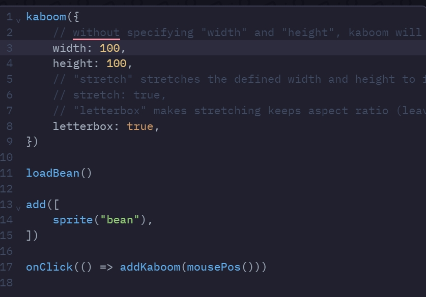
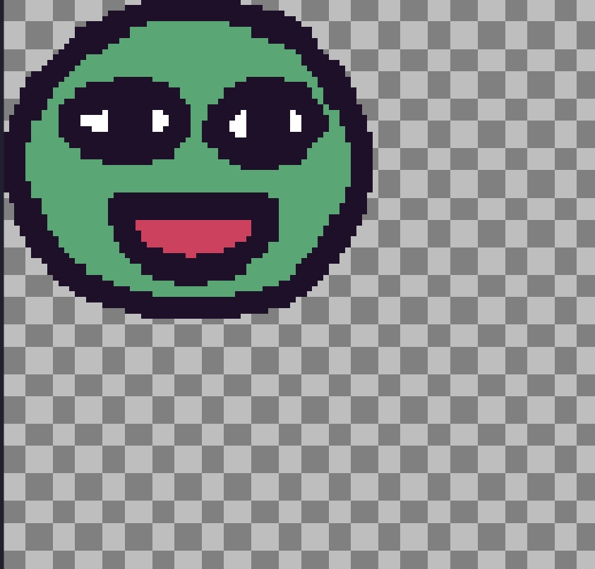
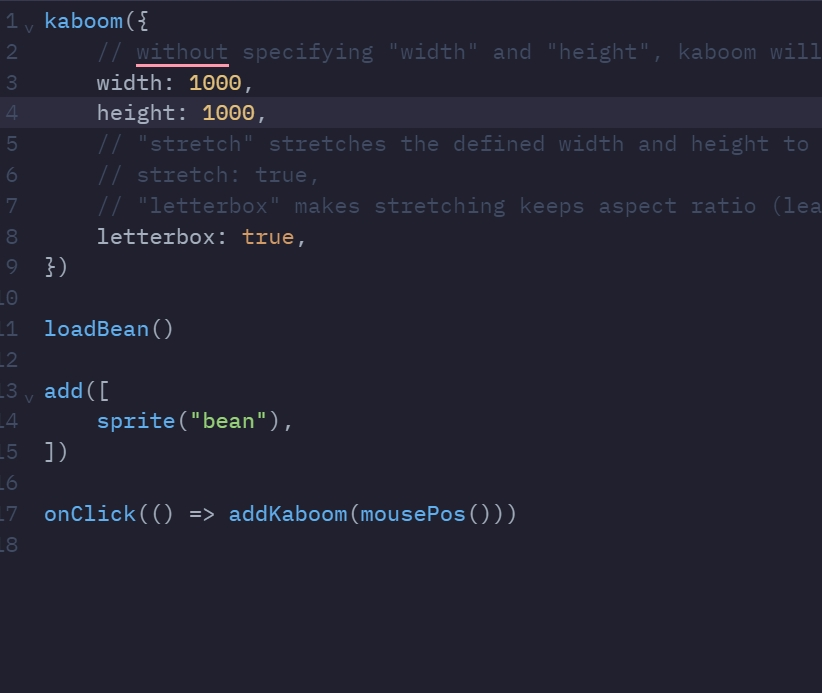
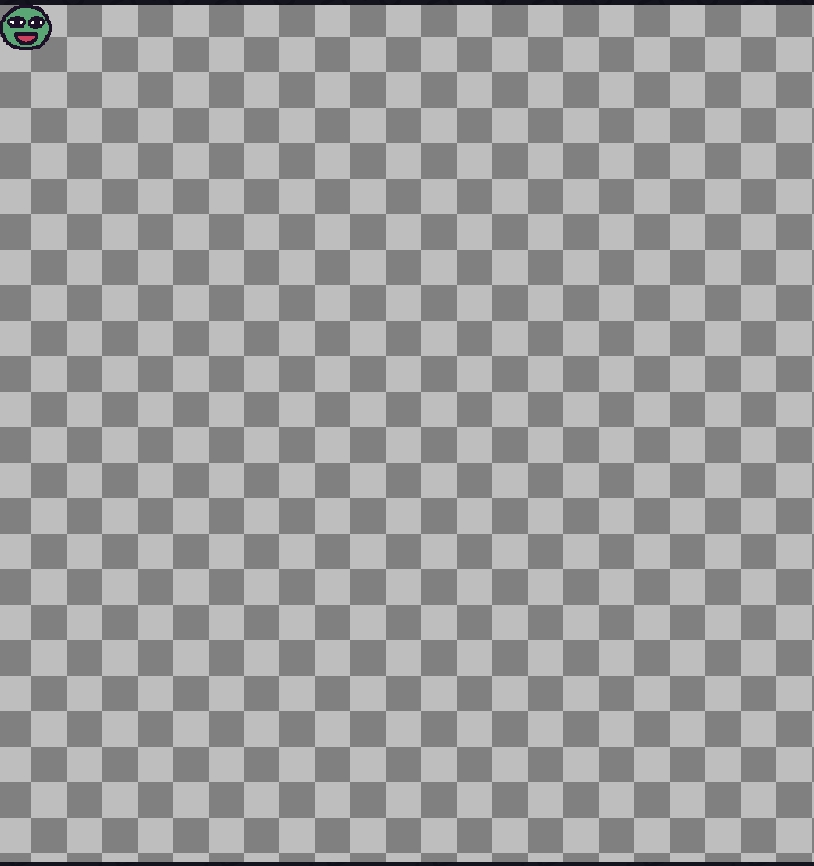
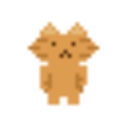
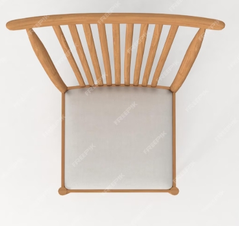
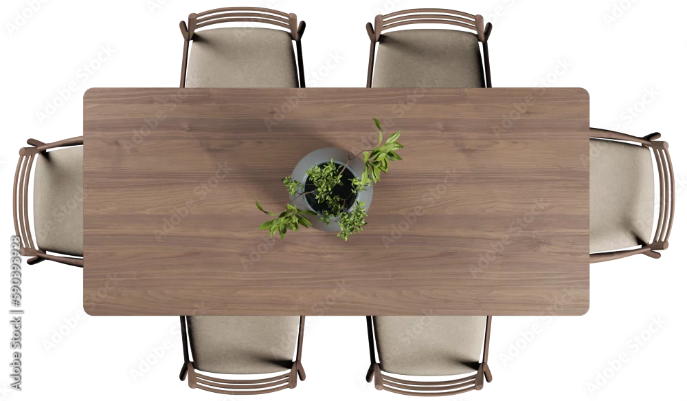
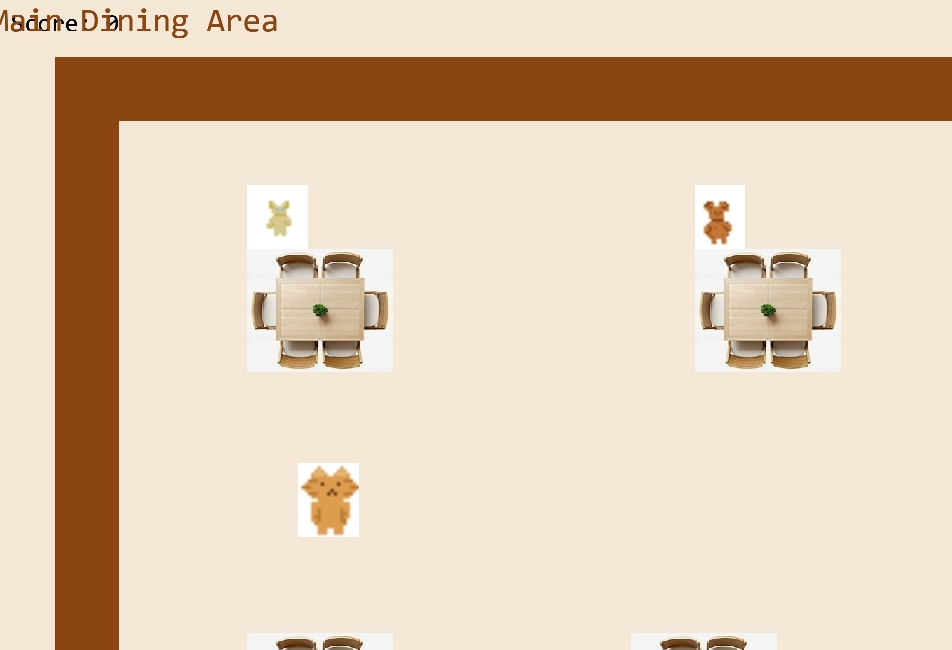

# Tool Learning Log

## Tool: **kaboom**

## Project: **cooking game**

---

### 10/6/24:
To start with kaboom I started with the base for kaboom and where my game will be using the src provided by kaboom on their website into my own html on jsbin.
  
The code for this is:
`````
<script type="module">

import kaboom from "https://unpkg.com/kaboom@3000.0.1/dist/kaboom.mjs";

kaboom();

]);

</script>
`````
You would add the code to your html in the script. I then started to change some code I had copied from the Kaboom ad.

### 10/20/24
The first thing I learned was how to add sprite, the code for this is: 
`````js
// start the game
kaboom()

// define gravity
setGravity(2400)

// load a default sprite
loadBean()

// add character to screen, from a list of components
const player = add([
    sprite("bean"),  // renders as a sprite
    pos(120, 80),    // position in world
    area(),          // has a collider
    body(),          // responds to physics and gravity
])

// jump when player presses "space" key
onKeyPress("space", () => {
    // .jump() is provided by the body() component
    player.jump()
})
`````
This is the basic way to add a sprite, you can change the name and give it a different position.
Another code I learned was adding different sprites together and making shapes.
`````js
add([ pos(80, 240), 
rect(700, 20),
outline(4), 
area(), ])
`````
`````js
	add([
    pos(350, 200),
    circle(16),
])
``````
As you can see I added a rectangle and a circle using the shape name and put it using position.
So with all these together I made 
`````js
kaboom()

loadSprite("bean", "/sprites/ghosty.png")
loadSprite("ghosty", "/sprites/bean.png")


const player = add([
	sprite("bean"), 
	pos(200, 200),
	rotate(0),    
	anchor("center"),
])


player.onUpdate(() => {

	player.angle += 120 * dt()
})

// Add multiple game objects
for (let i = 0; i < 3; i++) {


	const x = rand(0, width())
	const y = rand(0, height())

	const ghost = add([
		sprite("ghosty"),
		pos(x, y),
	])
	add([
    pos(80, 240),
    rect(700, 20),
    outline(4),
    area(),
])
	add([
    pos(350, 200),
    circle(16),
])
	add([
    pos(500, 200),
    circle(16),
])
}
`````

This is the thing I made from using all the code, I will use more of these code for the future and hone my skills further. So for the freedom project I will be ready to make a game with some prior knowledge.

## LL2

### 10/26/24

After learning things from LL1. I used that and other codes I learned for LL2. So the first thing I learned was giving blocks a mass and being able to move it. 
`````js
body({ mass: 10 }),
`````
This code allowed me to give my sprites a mass and was able to more it.
Another thing I learned was 
`````js
onKeyDown(" ", () => {
	player.angle += SPEED * dt()
	player.move(0, -SPEED)
	player.move(0, SPEED)
})
`````

All three of these are things you can put in the code. One of the rotates the sprites, another cod moves the sprites up or down. The last one moves it left or right.

Now if we go to the playground, I used the collision and changed the code for I changed it so you can use wasd to move, made it so the sprites are different and so the metal and grass block can move when you push it.

The code for this is 

`````js
// Collision handling
kaboom({
	scale: 2,
})

loadSprite("bean", "/sprites/ghosty.png")
loadSprite("ghosty", "/sprites/bean.png")
loadSprite("grass", "/sprites/grass.png")
loadSprite("steel", "/sprites/steel.png")

const SPEED = 320

const player = add([
	sprite("bean"),
	pos(80, 40),
	color(),
	rotate(0),
	area(),
	body(),
])


onKeyDown("a", () => {
	player.move(-SPEED, 0)
})

onKeyDown("d", () => {
	player.move(SPEED, 0)
})

onKeyDown("w", () => {
	player.move(0, -SPEED)
})

onKeyDown("s", () => {
	player.move(0, SPEED)
})

onKeyDown("t", () => {
	player.angle += SPEED * dt()
})

onKeyDown("g", () => {
	player.angle += SPEED * dt()
})

for (let i = 0; i < 3; i++) {

	const x = rand(0, width())
	const y = rand(0, height())

	add([
		sprite("ghosty"),
	        pos(x, y),

		area(),
		"enemy",
	])

}

add([
	sprite("grass"),
	pos(center()),
	area(),
	body({ isStatic: true }),
		body({ mass: 10 }),
	"grass",
])

add([
	sprite("steel"),
	pos(100, 200),
	area(),
	body({ mass: 10 }),
])


player.onCollide("enemy", (enemy) => {
	destroy(enemy)
})


player.onCollideUpdate("enemy", () => {
})


player.onCollideEnd("grass", (a) => {
	debug.log("leave grass")
})


player.onClick(() => {
	debug.log("hello")
})

player.onUpdate(() => {
	// .isHovering() is provided by area() component, which returns a boolean of if the object is currently being hovered on
	if (player.isHovering()) {
		player.color = rgb(0, 0, 255)
	} else {
		player.color = rgb()
	}
})


debug.inspect = true

`````
This is before, where we didn't move anything.


This is after, where we ate everything and move the blocks with wasd using the code we learn and the sprites moving


So this is what I learned and hope to use it for the future when making my freedomproject game.


### LL3
### 11/11/24

For LL3 I learned a couple more codes.
The first code I learned is:
`````
const SPEED = 1000
````
This allows us to change how fast the character goes. Another code I learned is
`````
setGravity(1000)
`````
This allows us to change the gravity.
`````
Another code I been learning througout the learning log is 
`````
onKeyPress("space", () => {
	if (player.isGrounded()) {
		player.jump()
	}
})

onKeyDown("a", () => {
	player.move(-SPEED, 0)
})

onKeyDown("d", () => {
	player.move(SPEED, 0)
})
`````
This code, is how they move. when you have one key down they will more in that way. So -speed with go left and speed will go right. The space allows us to jump.

For LL3 I made a platform with the code I learned you are able to move around super fast and it feels like you are flying. The code below is the code I used.
`````
// Build levels with addLevel()

// Start game
kaboom()

// Load assets
loadSprite("bean", "/sprites/bean.png")
loadSprite("coin", "/sprites/coin.png")
loadSprite("spike", "/sprites/spike.png")
loadSprite("grass", "/sprites/grass.png")
loadSprite("ghosty", "/sprites/ghosty.png")
loadSound("score", "/examples/sounds/score.mp3")

const SPEED = 20000

setGravity(1000)

const level = addLevel([
	// Design the level layout with symbols
	"@  ^ $$",
	"=======",
], {
	// The size of each grid
	tileWidth: 64,
	tileHeight: 64,
	// The position of the top left block
	pos: vec2(100, 200),
	// Define what each symbol means (in components)
	tiles: {
		"@": () => [
			sprite("bean"),
			area(),
			body(),
			anchor("bot"),
			"player",
		],
		"=": () => [
			sprite("grass"),
			area(),
			body({ isStatic: true }),
			anchor("bot"),
		],
		"$": () => [
			sprite("coin"),
			area(),
			anchor("bot"),
			"coin",
		],
		"^": () => [
			sprite("spike"),
			area(),
			anchor("bot"),
			"danger",
		],
	},
})

// Get the player object from tag
const player = level.get("player")[0]

// Movements
onKeyPress("space", () => {
	if (player.isGrounded()) {
		player.jump()
	}
})

onKeyDown("a", () => {
	player.move(-SPEED, 0)
})

onKeyDown("d", () => {
	player.move(SPEED, 0)
})

// Back to the original position if hit a "danger" item
player.onCollide("danger", () => {
	player.pos = level.tile2Pos(0, 0)
})

// Eat the coin!
player.onCollide("coin", (coin) => {
	destroy(coin)
	play("score")
})
`````

This is what I did for LL3 and I will improve more so I can go on my freedom project.


# LL4
## 11/24/24
In LL3 I learned how to change the speed of myself but this time I can change the speed of the enemy and different things like bullets.
`````js
const SPEED = 500
const ENEMY_SPEED = 300
const BULLET_SPEED = 1000
`````
So the const makes it a variable which is a string and the SPEED makes it so it can be faster or slower.
Another thing I learned is what the character is doing. The code for this is 
`````js
	state("move", [ "idle", "attack", "move" ]),
`````
````js
enemy.onStateEnter("idle", async () => {
	await wait(0.1)
	enemy.enterState("attack")
})
````
This code makes it so the character become idle for 0.1 after attacking. 

```js
enemy.onStateEnter("attack", async () => {
```
This is saying that when attacking there will be a bullet. 

`````js
if (player.exists()) {

		const dir = player.pos.sub(enemy.pos).unit()

		add([
			pos(enemy.pos),
			move(dir, BULLET_SPEED),
			rect(100, 12),
			area(),
			offscreen({ destroy: false }),
			anchor("center"),
			color(YELLOW),
			"bullet",
		])

	}

	await wait(0.1)
	enemy.enterState("move")

})
`````
This code makes it so if a player exists the enemy will attack you and we can change the bullets sizes and color and other properties.

Together with all this code we make:
``````js
// Use state() component to handle basic AI

// Start kaboom
kaboom()

// Load assets
loadSprite("bean", "/sprites/bean.png")
loadSprite("ghosty", "/sprites/ghosty.png")

const SPEED = 500
const ENEMY_SPEED = 300
const BULLET_SPEED = 1000

// Add player game object
const player = add([
	sprite("bean"),
	pos(80, 80),
	area(),
	anchor("center"),
])

const enemy = add([
	sprite("ghosty"),
	pos(width() - 80, height() - 80),
	anchor("center"),
	// This enemy cycle between 3 states, and start from "idle" state
	state("move", [ "idle", "attack", "move" ]),
])

// Run the callback once every time we enter an "idle" state.
// Here we stay "idle" for 0.5 second, then enter the "attack" state.
enemy.onStateEnter("idle", async () => {
	await wait(0.1)
	enemy.enterState("attack")
})

// When we enter "attack" state, we fire a bullet, and enter "move" state after 1 sec
enemy.onStateEnter("attack", async () => {

	// Don't do anything if player doesn't exist anymore
	if (player.exists()) {

		const dir = player.pos.sub(enemy.pos).unit()

		add([
			pos(enemy.pos),
			move(dir, BULLET_SPEED),
			rect(100, 12),
			area(),
			offscreen({ destroy: false }),
			anchor("center"),
			color(YELLOW),
			"bullet",
		])

	}

	await wait(0.1)
	enemy.enterState("move")

})

enemy.onStateEnter("move", async () => {
	await wait(1)
	enemy.enterState("idle")
})

// Like .onUpdate() which runs every frame, but only runs when the current state is "move"
// Here we move towards the player every frame if the current state is "move"
enemy.onStateUpdate("move", () => {
	if (!player.exists()) return
	const dir = player.pos.sub(enemy.pos).unit()
	enemy.move(dir.scale(ENEMY_SPEED))
})

// Taking a bullet makes us disappear
player.onCollide("bullet", (bullet) => {
	destroy(bullet)
	destroy(player)
	addKaboom(bullet.pos)
})

// Register input handlers & movement
onKeyDown("a", () => {
	player.move(-SPEED, 0)
})

onKeyDown("d", () => {
	player.move(SPEED, 0)
})

onKeyDown("w", () => {
	player.move(0, -SPEED)
})

onKeyDown("s", () => {
	player.move(0, SPEED)
})
``````
This is how it works and what the codes did. This is what I did for LL4.


# LL5
# 12/8/24

For LL5 I learned two different codes one where when you move your mouses up or down it will follow and another where when you scroll it will change the size of the object that is there.


`````js
// Mouse handling
onUpdate(() => {
	if(isMouseDown("left") && isMouseMoved()) {
		cameraPosition = cameraPosition.sub(mouseDeltaPos().scale(1 / cameraScale))
		camPos(cameraPosition)
	}
})

onScroll((delta)=>{
	cameraScale = cameraScale * (1 - 0.1 * Math.sign(delta.y))
	camScale(cameraScale)
})
`````
These are the codes which makes it so when you move it will move with you and the scroll will change the size. Now lets add this with other codes and see what happens.

`````js
kaboom()

let cameraPosition = camPos()
let cameraScale = 1

// Loads a random 2500px image
loadSprite("bigyoshi", "/examples/sprites/YOSHI.png")

add([
	sprite("bigyoshi"),
])

// Adds a label
const label = make([
	text("Booooooo"),
])

add([
	rect(label.width, label.height),
	color(0, 0, 0),
])

add(label)

// Mouse handling
onUpdate(() => {
	if(isMouseDown("left") && isMouseMoved()) {
		cameraPosition = cameraPosition.sub(mouseDeltaPos().scale(1 / cameraScale))
		camPos(cameraPosition)
	}
})

onScroll((delta)=>{
	cameraScale = cameraScale * (1 - 0.1 * Math.sign(delta.y))
	camScale(cameraScale)
})
`````
So we used the code we just learned and other codes from the past to make this booo move with our mouse. 

This was before

This was after

This was also after


As you can see when you move you can move it and it will change what it looks like just by using your mouse. This was my LL5 and there will be more to come for the next LL.


## LL6
## 12/29/24

So for LL6 I got started on planning for my project. So what I did first was make levels where the player can talk to people. So during the break the plan was for me and Johnny to talk and work together throughout the break and that is what we did. So what Johnny did was do the planning on a google drawing, after I used his model and made a level and a testing plan. Which you can see below. 

````` js
// simple rpg style walk and talk

kaboom({
	background: [74, 48, 82],
})

loadSprite("bag", "/sprites/../bag.png")
loadSprite("ghosty", "/sprites/../ghost.png")
loadSprite("grass", "/sprites/../grass.png")
loadSprite("steel", "/sprites/../steel.png")
loadSprite("door", "/sprites/../door.png")
loadSprite("key", "/sprites/../key.png")
loadSprite("bean", "/sprites/../bean.png")

scene("main", (levelIdx) => {

	const SPEED = 320

	// character dialog data
	const characters = {
		"a": {
			sprite: "bag",
			msg: "Hi Bean! I would like ...",
		},
		"b": {
			sprite: "ghosty",
			msg: "Who are you? You can see me??",
		},
	}

	// level layouts
	const levels = [
		[
			"---|--------",
			"-     -    -",
			"- $   -    -",
			"-    a-    -",
			"-     -- ---",
			"-   @-     -",
			"-          -",
			"-  - - -   -",
			"-          -",
			"-    -     -",
			"------------",
		],
		[
			"---------",
			"-       -",
			"-   $   -",
			"|       -",
			"-    b  -",
			"-  @    -",
			"---------",
		],
	]

	const level = addLevel(levels[levelIdx], {
		tileWidth: 64,
		tileHeight: 64,
		pos: vec2(64, 64),
		tiles: {
			"=": () => [
				sprite("grass"),
				area(),
				body({ isStatic: true }),
				anchor("center"),
			],
			"-": () => [
				sprite("steel"),
				area(),
				body({ isStatic: true }),
				anchor("center"),
			],
			"$": () => [
				sprite("key"),
				area(),
				anchor("center"),
				"key",
			],
			"@": () => [
				sprite("bean"),
				area(),
				body(),
				anchor("center"),
				"player",
			],
			"|": () => [
				sprite("door"),
				area(),
				body({ isStatic: true }),
				anchor("center"),
				"door",
			],
		},
		// any() is a special function that gets called everytime there's a
		// symbole not defined above and is supposed to return what that symbol
		// means
		wildcardTile(ch) {
			const char = characters[ch]
			if (char) {
				return [
					sprite(char.sprite),
					area(),
					body({ isStatic: true }),
					anchor("center"),
					"character",
					{ msg: char.msg },
				]
			}
		},
	})

	// get the player game obj by tag
	const player = level.get("player")[0]

	function addDialog() {
		const h = 160
		const pad = 16
		const bg = add([
			pos(0, height() - h),
			rect(width(), h),
			color(0, 0, 0),
			z(100),
		])
		const txt = add([
			text("", {
				width: width(),
			}),
			pos(0 + pad, height() - h + pad),
			z(100),
		])
		bg.hidden = true
		txt.hidden = true
		return {
			say(t) {
				txt.text = t
				bg.hidden = false
				txt.hidden = false
			},
			dismiss() {
				if (!this.active()) {
					return
				}
				txt.text = ""
				bg.hidden = true
				txt.hidden = true
			},
			active() {
				return !bg.hidden
			},
			destroy() {
				bg.destroy()
				txt.destroy()
			},
		}
	}

	let hasKey = false
	const dialog = addDialog()

	player.onCollide("key", (key) => {
		destroy(key)
		hasKey = true
	})

	player.onCollide("door", () => {
		if (hasKey) {
			if (levelIdx + 1 < levels.length) {
				go("main", levelIdx + 1)
			} else {
				go("main", levelIdx - 1)
			}
		} else {
			dialog.say("you got no key!")
		}
	})

	// talk on touch
	player.onCollide("character", (ch) => {
		dialog.say(ch.msg)
	})

	const dirs = {
		"left": LEFT,
		"right": RIGHT,
		"up": UP,
		"down": DOWN,
	}

	for (const dir in dirs) {
		onKeyPress(dir, () => {
			dialog.dismiss()
		})
		onKeyDown(dir, () => {
			player.move(dirs[dir].scale(SPEED))
		})
	}

})

scene("win", () => {
	add([
		text("You Win!"),
		pos(width() / 2, height() / 2),
		anchor("center"),
	])
})

go("main", 0)

`````
What this code does is that you can talk to people and go between two levels. 



You can hop between the levels.



This shows that I was able to use my ide and put everything on there.

This is what we did for LL6 and we are planning on changing the texture and adding music to it for the next LL.


LL9
3/8/25

So for the LL9 I had to learn how to size and resize something since when I was doing it last time I didn't change the size of anything and it could be important. So I learned how to change the size of a character and the background. So as you can see here everything changes when changing the numbers with width and height.



As you can see here, the thing became really big since I changed the values, but if I made it bigger, it became smaller.


As you can see in the code the value is bigger but the character became small. So this is what I learned.


This is what I did and it should be helpful in the future for when customizing character sizes!

LL10
3/22/25

So for LL10 I started making characters out of pixels, and I will make more characters in the future. We are making our own character for the project as we need to make npc, characters to play with. So as you can see in the picture. 





As you can see here, we started making characters out of using pixels. We are planning on using characters we made in the game. We found textures of the chairs and other things, as you can see here:
These are things we are planning on using during our project so for this learning log I did research on pictures that we can ad to the game and make our own characters. This is what I did for LL10 and I am planning on doing more characters. 

LL10
3/20/25

So for LL11 what I did was made an outline and tables where you can talk to NPCs that ask for food, We added our own characters and made it look like a restaurant, so the code for this is below
`````js
<!DOCTYPE html>
<html>
    <head>
        <meta charset="utf-8">
        <meta name="viewport" content="width=device-width, initial-scale=1">
        <link href="https://cdn.jsdelivr.net/npm/bootstrap@5.2.1/dist/css/bootstrap.min.css" rel="stylesheet" />
        <title>Restaurant Adventure</title>
        <style>
            body {
                background-color: #333;
                overflow: hidden;
            }
        </style>
    </head>
    <body>
        <script src="https://cdn.jsdelivr.net/npm/bootstrap@5.2.1/dist/js/bootstrap.bundle.min.js"></script>
        <script src="https://unpkg.com/kaboom@3000.0.1/dist/kaboom.js"></script>
        <script>
            // Initialize Kaboom with larger canvas
            kaboom({
                background: [245, 231, 213], // Creamy restaurant wall color
                width: 1024,  // Increased canvas width
                height: 768    // Increased canvas height
            });

            // Load restaurant-themed sprites
            loadSprite("chef", "sprites/../c.png");
            loadSprite("customer1", "sprites/../c1.png");
            loadSprite("customer2", "sprites/../c3.png");
            loadSprite("table", "sprites/../t.png");
            loadSprite("door", "sprites/../door.png");

            // Define restaurant characters and their dialog
            const characters = {
                "c": { // Customer 1
                    sprite: "customer1",
                    msg: "I'd like a meal, please!",
                },
                "d": { // Customer 2
                    sprite: "customer2",
                    msg: "Can I get something to eat?",
                },
                "e": { // Customer 3
                    sprite: "customer1",
                    msg: "Just a simple dish for me, thanks!",
                },
                "m": { // Manager
                    sprite: "customer2",
                    msg: "Make sure the restaurant runs smoothly!",
                }
            };

            // Define larger restaurant area
            const levels = [
                // Expanded level - Dining Area
                [
                    "----------------------",
                    "-                   -",
                    "-  c      d       e -",
                    "-  T      T       T -",
                    "-                   -",
                    "-                   -",
                    "-         @         -",
                    "-                   -",
                    "-                   -",
                    "-  T     T        T -",
                    "-  m               -",
                    "-                   -",
                    "----------------------",
                ]
            ];

            // Game variables
            let score = 0;

            // Main game scene
            scene("main", (levelIdx) => {
                const SPEED = 240;

                // Create the level with adjusted tile size for larger area
                const level = addLevel(levels[levelIdx], {
                    tileWidth: 64,
                    tileHeight: 64,
                    pos: vec2(64, 64),
                    tiles: {
                        "-": () => [
                            rect(64, 64),
                            color(139, 69, 19), // Wooden floor
                            area(),
                            body({ isStatic: true }),
                        ],
                        "T": () => [
                            sprite("table"),
                            area(),
                            body({ isStatic: true }),
                            "furniture",
                            scale(0.7) // Scaled down tables
                        ],
                        "@": () => [
                            sprite("chef"),
                            area(),
                            body(),
                            "chef",
                            scale(0.5) // Scaled down chef
                        ]
                    },
                    wildcardTile(ch) {
                        const char = characters[ch];
                        if (char) {
                            return [
                                sprite(char.sprite),
                                area(),
                                body({ isStatic: true }),
                                "character",
                                {
                                    msg: char.msg
                                },
                            ];
                        }
                    },
                });

                // Get the player object
                const chef = level.get("chef")[0];

                // Dialog system
                function addDialog() {
                    const h = 120;
                    const pad = 16;
                    const bg = add([
                        pos(0, height() - h),
                        rect(width(), h),
                        color(0, 0, 0, 200),
                        z(100),
                    ]);
                    const txt = add([
                        text("", {
                            width: width() - pad * 2,
                            size: 18
                        }),
                        pos(pad, height() - h + pad),
                        z(100),
                        color(255, 255, 255),
                    ]);
                    bg.hidden = true;
                    txt.hidden = true;
                    return {
                        say(t) {
                            txt.text = t;
                            bg.hidden = false;
                            txt.hidden = false;
                        },
                        dismiss() {
                            if (!this.active()) return;
                            txt.text = "";
                            bg.hidden = true;
                            txt.hidden = true;
                        },
                        active() {
                            return !bg.hidden;
                        },
                    };
                }

                const dialog = addDialog();

                // Score display
                const scoreDisplay = add([
                    text(`Score: ${score}`, { size: 24 }),
                    pos(20, 20),
                    color(0, 0, 0),
                    z(50),
                    fixed()
                ]);

                // Interact with customers
                chef.onCollide("character", (customer) => {
                    dialog.say(customer.msg);
                });

                // Player movement
                const dirs = {
                    "left": LEFT,
                    "right": RIGHT,
                    "up": UP,
                    "down": DOWN,
                };
                for (const dir in dirs) {
                    onKeyPress(dir, () => dialog.dismiss());
                    onKeyDown(dir, () => chef.move(dirs[dir].scale(SPEED)));
                }

                // Display area name
                const areaNames = ["Main Dining Area"];
                add([
                    text(areaNames[levelIdx], {
                        size: 32,
                        width: width(),
                    }),
                    pos(width() / 2, 30),
                    anchor("center"),
                    color(139, 69, 19),
                    z(50),
                    fixed()
                ]);
            });

            // Start the game
            go("main", 0);
        </script>
    </body>
</html>
`````


I added more to what I did and made more of it. This is what I did for LL11 and will be adding more levels to it.

<!-- 
* Links you used today (websites, videos, etc)
* Things you tried, progress you made, etc
* Challenges, a-ha moments, etc
* Questions you still have
* What you're going to try next
-->


